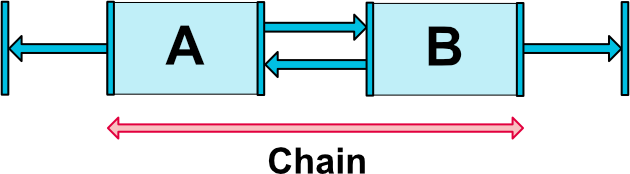

# Construindo layouts complexos com ConstraintLayout

###Felipe Arimatéia


---

## **Felipe Arimatéia (Ari)**

Mobile Developer desde de 2010, apaixonado por código e viciado em séries.

 @twiterdoari

 +FelipeArimateia

 felipearimateia


---

## O que há de novo?

Durante o Google I/O 2016 foi anunciado novas tools e libraries para elaboração de layouts.

O Android Studio ganhou um editor de layout baseado em constrantis e também foi criado um novo container chamado **ConstraintLayout**.

---

## Configurando

* Baixar o [Android Studio 2.2.1](https://developer.android.com/develop/index.html)

* E adicionar a dependência para ConstraintLayout:


```gradle
	compile 'com.android.support.constraint:constraint-layout:1.0.0-alpha9'
```

---

# Constraint Layout


---

## O que é?

**Constraint** é a descrição de como um elemento deve posicionar-se na view em relação a outros elementos.

Mesmo sendo similar ao *RelativeLayout*, **ConstraintLayout** é mais flexível e foi criado para ser usado com o novo editor de layout.

---

## Tipos de constraints

**Side connection with the layout**


<!---->

Conectar as laterais de um elemento nas extremidates do ConstraintLayout.

---

## Tipos de constraints

**Side connection with a view**


<!---->

Conectar a extremidade de uma view, na extremidade oposta de outra view.

---

## Tipos de constraints

**Side alignment with a view**

<!---->


Alinhar uma das bordas da view na mesma borda de outra view.

---

## Tipos de constraints

**Baseline alignment with a view**


Alinhar a baseline de uma view com a baseline de outra view.

---

## Visibilidade

O ConstraintLayout tem um tratamento específco para views que são marcadas como *View.GONE*.

* Seu tamanho será considerado zero
* As restrições de outras views que estão anconradas na view marcada como *GONE* serão respeitadas.


---

## Visibilidade

Quando a visibilidade de uma view âncora é View.GONE, é possível indicar um valor de margem diferente para ser usado.

* layout_goneMarginStart
* layout_goneMarginEnd
* layout_goneMarginLeft
* layout_goneMarginTop
* layout_goneMarginRight
* layout_goneMarginBottom

---

## Chains

As chains permitem que você configure um determinado comportamento de grupo sobre um único eixo horizontal ou vertical.

* Chains necessitam de restrições bi-direcionais
* Você pode posicionar os elementos igualmente no espaço disponível ou definir pesos



---

## Chains

```xml
<TextView
        android:text="Felipe Arimateia Terra Souza"
        android:layout_width="0dp"
        android:layout_height="wrap_content"
        app:layout_constraintTop_toTopOf="parent"
        android:id="@+id/textView"
        android:layout_marginTop="16dp"
        android:layout_marginLeft="16dp"
        app:layout_constraintRight_toLeftOf="@+id/textView2"
        app:layout_constraintLeft_toLeftOf="parent"
        app:layout_constraintHorizontal_bias="0.37"
        app:layout_constraintHorizontal_chainPacked="true"
        app:layout_constraintHorizontal_weight="2"/>

    <TextView
        android:text="TextView"
        android:layout_width="wrap_content"
        android:layout_height="wrap_content"
        android:id="@+id/textView2"
        app:layout_constraintRight_toRightOf="parent"
        app:layout_constraintLeft_toRightOf="@+id/textView"
        app:layout_constraintHorizontal_weight="1"
        android:layout_marginTop="16dp"
        android:layout_marginRight="16dp"
        app:layout_constraintTop_toTopOf="parent" />
```

---

## Aspect Ratio

Veja como é fácil adicionar uma view 16:9 ou 4:3, sem precisar criar uma custom view:

```xml
 <ImageView
        android:layout_width="0dp"
        android:layout_height="wrap_content"
        ...
        app:layout_constraintDimensionRatio="16:9"/>
```


---

## Guideline

**Guideline** é uma orientação vertical ou horizontal para adicionar restrições. As orientações podem ser adicionadas com base em dois tipos de unidades, porcentagem ou DP, em relação a borda do layout.


---

## LayoutParams

O **ConstraintLayout.LayoutParams** contém os diferentes atributos que especificam como a view se comporta dentro da ConstraintLayout.

```java
	android.support.constraint.ConstraintLayout.LayoutParams
```

---

## ConstraintSet
**ConstraintSet** permite definir programaticamente um conjunto de restrições para ser usado com ConstraintLayout.


```Java

ConstraintSet constraintSet = new ConstraintSet();

ConstraintLayout constraintLayout = (ConstraintLayout) findViewById(R.id.container);
constraintSet.clone(constraintLayout); // get constraints from ConstraintSet

 // pin to the bottom of the container
 constraintSet.connect(R.id.btn_ok, ConstraintSet.BOTTOM, R.id.container, ConstraintSet.BOTTOM, 8);

 // Apply the changes
 constraintSet.applyTo(constraintLayout);

```

---

# Editor


---

## Show Design + Blueprint

 O novo editor agora tem dois modos de visualização: design e blueprint


---

## Auto-connect

 O editor calcula e define automaticamente as constraints para os intens selecionados.


---

## Infer Constraints

 É similar ao auto-connect, mas o inference calcula e define as contraints para todas as views e não apenas para o elemento selecionado.

---

## Manual Constraints

É possível desativar o auto-connect e definir manualmente as contraints.


---

## Deletando apenas uma constraint


---

## Deletando todas as constraints


---

## View Sizing


 **Fixed:** O width/height tem tamanho fixo.

 **Any Size[^1]:** Ocupa todo o espaço disponível para satisfazer a restrição.

 **Wrap Content:** A view irá ocupar o espaço que é preciso para renderizar o contéudo.

[^1]: O Any Size é diferente do *match_parent*, ele não ocupa todo o espaço disponível na view pai.

---

## Vertical Bias

Ajuda a posicionar uma view no eixo vertical, ajustando o valor da *bia* em relação a constranit.


```xml
<ImageView
	...
	app:layout_constraintVertical_bias="0.5" />
```

---

## Horizontal Bias

Ajuda a posicionar uma view no eixo horizontal, ajustando o valor da *bia* em relação a constraint.


```xml
<ImageView
	...
	app:layout_constraintHorizontal_bias="0.5" />
```
---

# Referências

* [CodeLab](https://codelabs.developers.google.com/codelabs/constraint-layout/index.html#0)

* [Reference API](https://developer.android.com/reference/android/support/constraint/ConstraintLayout.html)

* [Build a Responsive UI with ConstraintLayout](https://developer.android.com/training/constraint-layout/index.html)

* [Exploring the new Android ConstraintLayout](https://medium.com/exploring-android/exploring-the-new-android-constraintlayout-eed37fe8d8f1#.j6mtaksa6)

* [ConstraintLayout Part 1](http://wiresareobsolete.com/2016/07/constraintlayout-part-1/)

* [New Layout Editor with Constraint Layout](http://tools.android.com/tech-docs/layout-editor)


---

# Obrigado!


